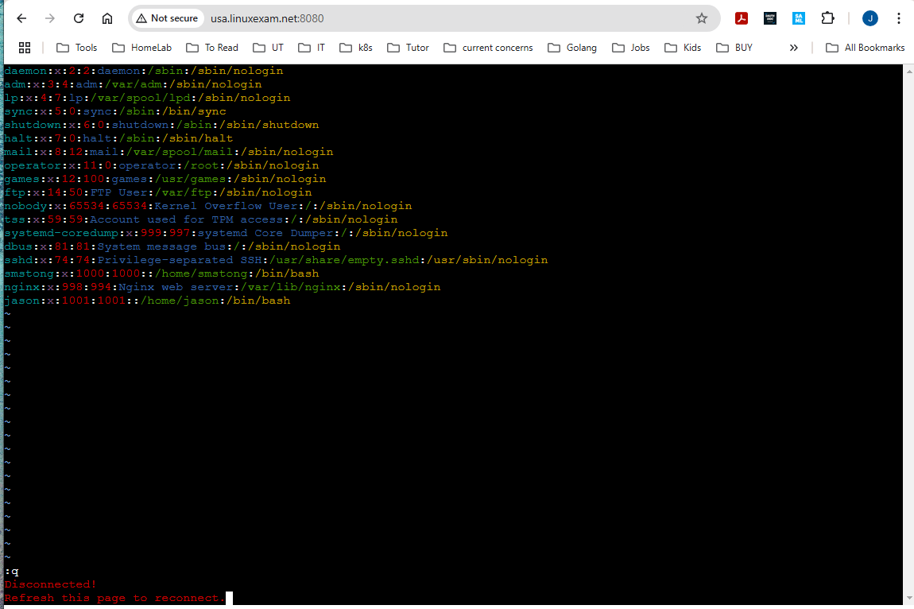

# Quick guide
webrun lets you run a CLI application and redirect its stdin/stdout/ctty to a web page.
If the application to run is a shell (e.g. bash), then webrun becomes a web shell.

webrun is written in golang, so running it doesn't need any dependencies except a morden Linux kernel.
The capability to run standalone is specially important for amdin tools.

## Install on a Linux host
Download "webrun" binary file from below URL
```
https://github.com/linuxexam/webrun/releases/
```
Alternatively, if you have go installed, run
```
go install github.com/linuxexam/webrun@latest
```

## run any command, if not provided, default to sh
Enter the directory where webrun was saved 
```
chmod +x webrun
./webrun
```
For help, run
```
./webrun -h
```

## access from browser
```
http://your-server:8080
```
# screenshots
```
webrun btop
```


```
webrun vim /etc/passwd
```
